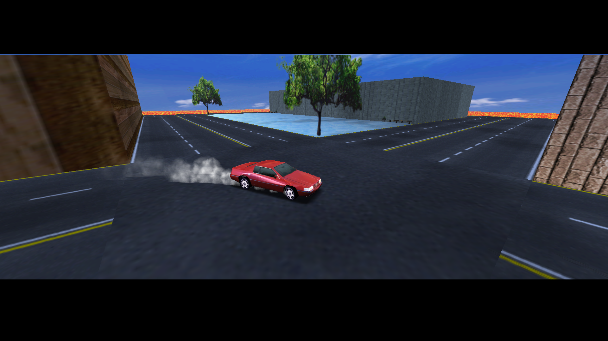

# Midtown Madness 1 Map Editor

Midtown Madness 1 is a racing game made Angel Studios, featuring the city of Chicago.

This Map Editor was developed to provide an easy way for users to create their own unique cities for Midtown Madness 1. 
Not only can you design roads, hills, and walls, but you can also customize textures, facades, props, AI paths, races, and even the HUD.

Upon completion of your design, the Editor will generate all necessary city files, compile them into an .ar file, and automatically boot the game with your new city preloaded.
