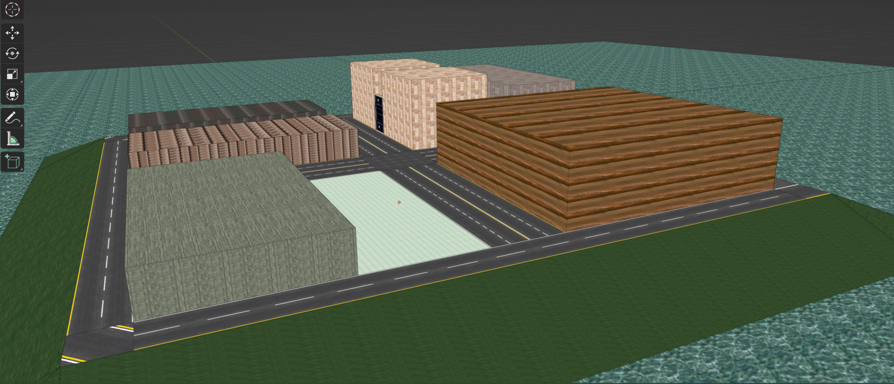
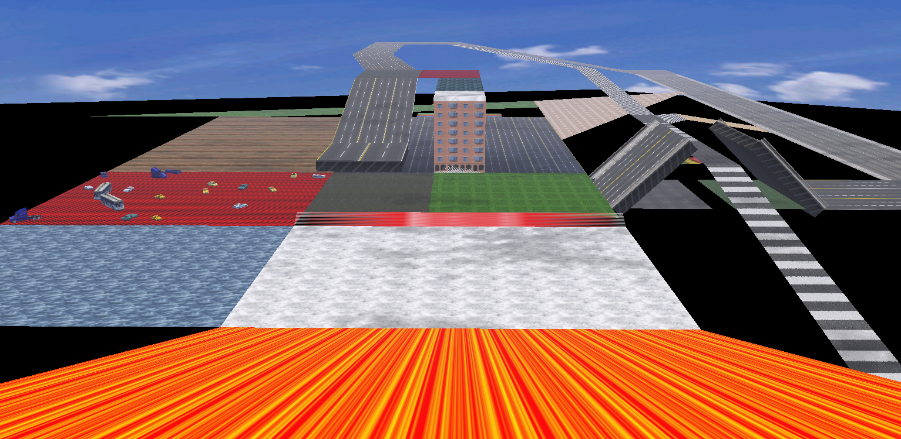
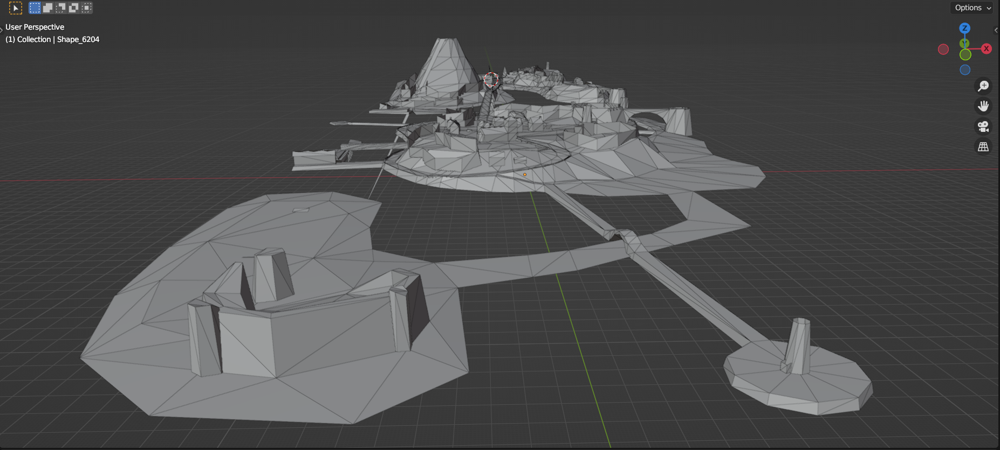
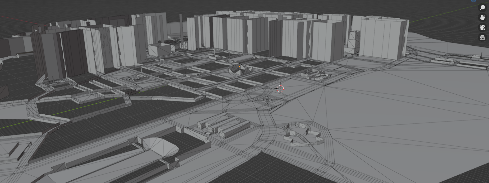
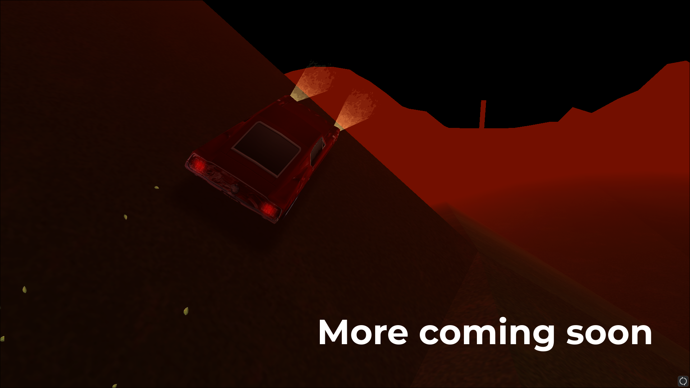

# Midtown Madness 1 Map Editor

Midtown Madness 1 is a racing game made by Angel Studios, featuring the city of Chicago.

This Map Editor was developed to provide an easy way for users to create their own unique cities for Midtown Madness 1. 
Not only can you design roads, hills, and walls, but you can also customize textures, facades, props, drawbridges, physics, animations, AI paths, races, and even the HUD.

Upon completion of your design, the Map Editor will generate all the necessary city files, compile them into an .AR file, and automatically boot the game with your new city preloaded.

## Installation

* Clone the repository
* Follow the setup guide in the Installation Instructions folder

## Credits

* 0x1F9F1 	- Instrumental help, including Open1560 features and coding Q&A
* Dading 	- Alpha tester, creator of Moronville
* Vwp914	- Alpha tester, Blender tutor
* DDucky 	- Code help with Prop Editor 

## Contact

If you have any questions or suggestions, feel free to reach out to me via Discord.

## Gallery

