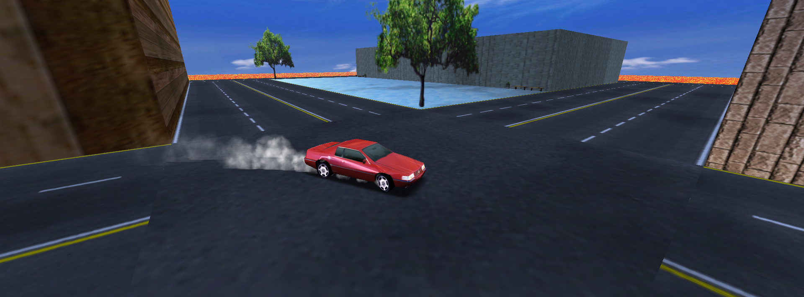
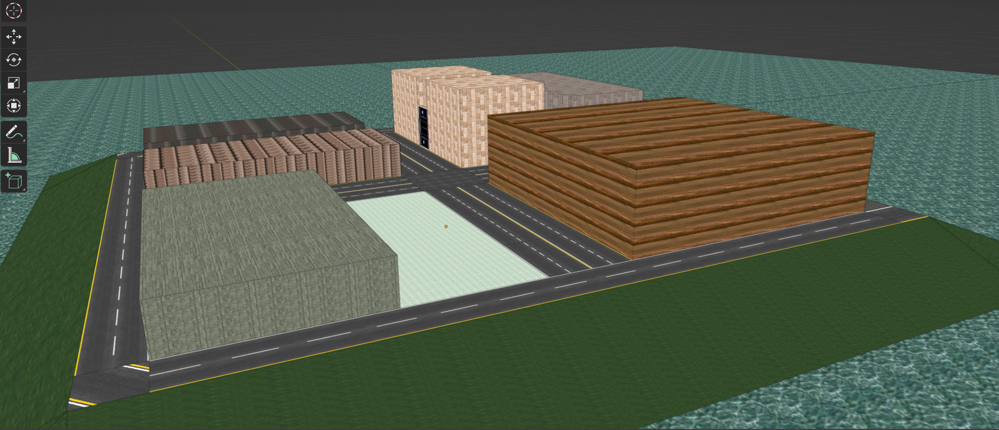
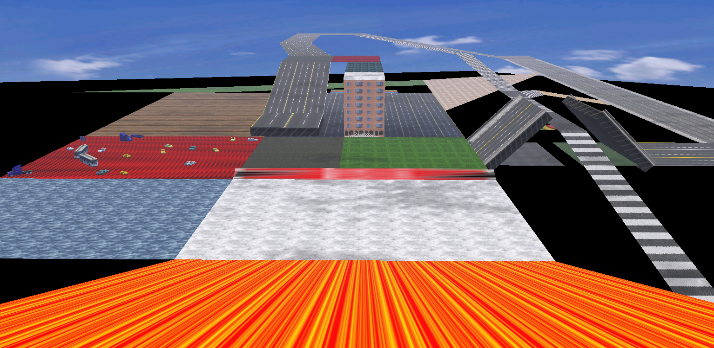
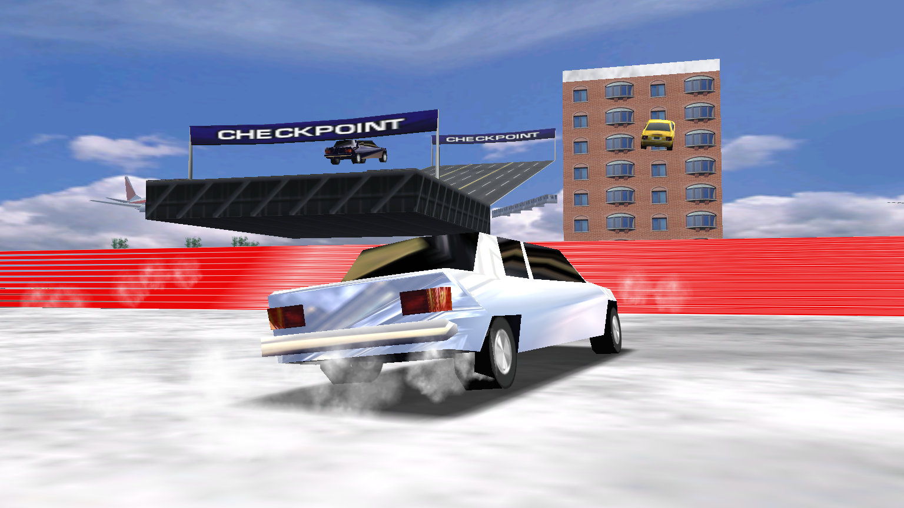

# Midtown Madness Map Editor



[](https://github.com/KcRobin9/MM1-Map-Editor/archive/refs/heads/main.zip)
[](https://discord.gg/tjTQAbFdqQ)

[Midtown Madness](https://en.wikipedia.org/wiki/Midtown_Madness) is a racing game made by [Angel Studios](https://gitlab.com/kbrobin9/gitlab-resources/-/blob/main/SQL_LIBRARY.MD?ref_type=heads), featuring the city of Chicago.

This Map Editor is developed to provide an easy way for users to create their own unique cities for Midtown Madness 1.            Not only can you design roads, hills, and walls, you may also customize textures, facades, props, drawbridges, animations, lighting, physics, AI paths, races, and even the HUD.

In addition, the Editor seamlessly integrates with the 3D modelling software [Blender](https://www.blender.org/). This enables quick importing & exporting of models. To further enhance the user experience, a custom Blender UI has been implemented. From here, all parameters of each polygon can be set and modified.   
This visual integration, combined with Blender's extensive features, significantly streamlines the design process, enabling swift tweaks and iterations.

Upon completion of your design, the Map Editor will generate all the necessary city files, compile them into an `.AR` file, and automatically boot the game with the new city preloaded.

## Installation

* Click the [Download](https://github.com/KcRobin9/MM1-Map-Editor/archive/refs/heads/main.zip) button or clone the repo: 
```
git clone https://github.com/KcRobin9/MM1-Map-Editor.git
```
* Follow the [Setup Guide](https://github.com/KcRobin9/MM1-Map-Editor/blob/main/Setup/SETUP.md)
* Further reading: 
    * [Tips & Tricks](https://github.com/KcRobin9/MM1-Map-Editor/blob/main/TIPS_TRICKS.md)
    * [Troubleshooting](https://github.com/KcRobin9/MM1-Map-Editor/blob/main/TROUBLESHOOTING.md)

## Contributions

Contributions are welcomed. All questions, feature requests, issues, and pull requests will be reviewed.

## Credits

* [0x1F9F1](https://github.com/0x1F9F1) - Instrumental help, including [Open1560](https://github.com/0x1F9F1/Open1560) features and coding Q & A
* [Dading](https://www.youtube.com/@dading5962) - Alpha tester, creator of [Moronville](https://cdn.discordapp.com/attachments/890529659756888074/1179102551724019773/MoronVille_City.ar?ex=664cd152&is=664b7fd2&hm=d5833aaee8cfc1e7e6eeadf64c64b0cd4d7dd29a2cf1fb752d6ae38c8c6f4989&)
* [Vwp914](https://github.com/Vwp914) - Alpha tester, Blender tutor
* [Lars](https://github.com/Larspolo) - For his Race Making Tool
* DDucky - Code help with Prop Editor
* [fatiyesman](https://github.com/fatiyesman) - Alpha tester, Contributer
## Gallery








