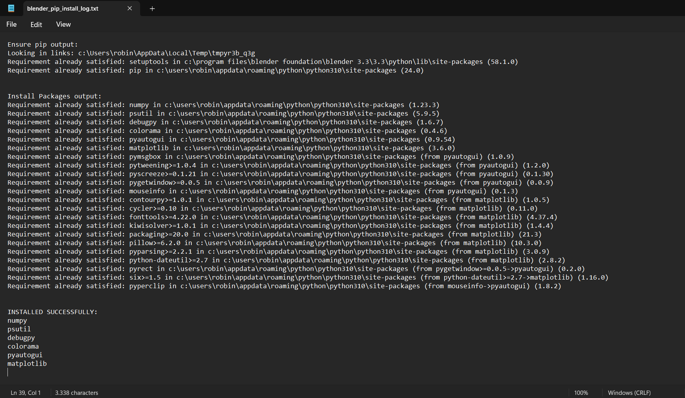
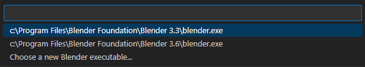
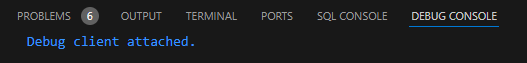

# Setup Guide

Depending on your current situation, the setup for the Map Editor may take around 30 minutes to complete.  
Please complete all steps below.

## Download

| Software | Version / Option | Recommendation 
|-------------------------------------------------|------------------------------------------|----------------------------------|
| [Python ](https://www.python.org/downloads/) | Latest* | Required |
| [Microsoft C++ Build Tools](https://visualstudio.microsoft.com/visual-cpp-build-tools/) | Desktop development with C++ | Required 
| [Blender ](https://www.blender.org/download/) | Latest | Strongly recommended
| [Visual Studio Code](https://code.visualstudio.com/download) | Latest | Strongly recommended |

*if you run into issues installing `bpy`, try version [3.7.6](https://www.python.org/ftp/python/3.7.6/python-3.7.6-amd64.exe)

## Installation
### Python
* Click on `Add Python to PATH` in the Setup Wizard and then choose Install

### Microsoft C++ Build Tools
* After the installation is complete, reboot your computer

### Test Python & Install Required Libraries
* Double click on `📄CLICK_ME.bat` to start the process

### Install Blender-Python Libraries
* Since Blender uses its own Python interpreter, you must install a few libraries from the previous step into Blender's Python Environment
* Open Blender as **administrator**, then click on the `Scripting` tab (top right corner)
* A new grey window appears, click on `📁 Open`
* Navigate to `...\MM1-Map-Editor\Setup` and select `blender_python_libraries.txt`
* The grey window is now filled with Python code. Next, click on the ▶️ button or hold `ALT + P` to start
* The process may take 30 - 120 seconds and Blender may freeze
* After the libraries have been installed, a log file will automatically open with the results
* Verify that all libraries (6) have been installed *succesfully*
* Close Blender (the application will likely be frozen)


				
### Connect Visual Studio Code to Blender
* Launch Visual Studio Code as **administrator** and open `MAP_EDITOR_ALPHA_v1.py`
* Next, click on the three-line menu icon at the top left corner. Then click on `File` and then on `Add Folder to Workspace...` 
* Make sure that the folder you select is `MM1-Map-Editor` and you click on `Add` at the bottom right of explorer menu
* Go back to Visual Studio Code with `MAP_EDITOR_ALPHA_v1.py` open, and hold `Shift + Q`



* Click on the Blender executable, if available, or click on `Choose a new Blender executable...` and navigate to e.g.:  
`C:\Program Files\Blender Foundation\Blender 4.0` and select the `blender.exe`
* Now hold `Shift + Q`* (again) and select an available Blender executable, the application will now start

*if the VScode Keybindings did not install succesfully, hold `CTRL + SHIFT + P` to open the Command Palette (then you can search for `Blender: Start` and `Blender: Run Script`)
* If you see the following message in Visual Studio Code, it means VScode and Blender have succesfully connected:



### Building your Map

* *Note*: `MAP_EDITOR_ALPHA_v1.py` contains a Test City, you may find the polygon data by searching for `TEST_CITY` (hold `CTRL + F`)
-----------------------------------
* Next, in VScode (with Blender connected), hold `Shift + W` (i.e. *Blender: Run Script*), the Map Editor will now start. *Only* and *only* when you see a message very similar to this, it means the script has *fully* ran:


* Alternatively, you can build the prepared Map without Blender connected. To do this, open `powershell.exe` in the main folder, then type:
```shell
python MAP_EDITOR_ALPHA_v1.py 
```

* Tip: type `python m` and press `TAB` to autofill the script's name
* If you are building without Blender connected and have `play_game = True` in the script, the script will automatically boot the game after it finished processing