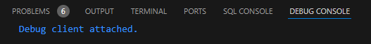

<!-- # Setup Guide

Depending on your current situation, the setup for the Map Editor may take around 30 minutes to complete.  
Please complete all steps below.

## Download

| Software | Version / Option | Recommendation 
|-------------------------------------------------|------------------------------------------|----------------------------------|
| [Python ](https://www.python.org/ftp/python/3.10.7/python-3.10.7-amd64.exe) | 3.10.7 | Required |
| [Microsoft C++ Build Tools](https://visualstudio.microsoft.com/visual-cpp-build-tools/) | Desktop development with C++ | Required 
| [Blender ](https://www.blender.org/download/) | Latest | Strongly recommended
| [Visual Studio Code](https://code.visualstudio.com/download) | Latest | Strongly recommended |

## Installation
### Python
* Click on `Add Python to PATH` in the Setup Wizard and then choose Install

### Microsoft C++ Build Tools
* After the installation is complete, reboot your computer

### Blender
* No additional information required. Just follow the installation wizard

### Visual Studio Code
* No additional information required. Just follow the installation wizard

### Test Python & Install Required Libraries
* In `📁 setup`, double click on `📄run_installer.bat` to start the process

### Install Blender-Python Libraries
* Since Blender uses its own Python interpreter, you must install a few libraries from the previous step into Blender's Python Environment
* Open Blender as **administrator**, then click on the `Scripting` tab (top right corner)
* A new grey window appears, click on `📁 Open`
* Navigate to `...\MM1-Map-Editor\setup` and select `blender_python_libraries.txt`
* The grey window is now filled with Python code. Next, click on the ▶️ button or hold `ALT + P` to start
* The process may take 30 - 120 seconds and Blender may freeze
* After the libraries have been installed, a log file will automatically open with the results
* Verify that all libraries (6) have been installed *succesfully*
* Close Blender (the application will likely be frozen)


				
### Connect Visual Studio Code to Blender
* Launch Visual Studio Code as **administrator** and open `MAP_EDITOR_ALPHA_v1.py`
* Next, click on the three-line menu icon at the top left corner. Then click on `File` and then on `Add Folder to Workspace...` 
* Make sure that the folder you select is `MM1-Map-Editor` and you click on `Add` at the bottom right of explorer menu
* * If you get a pop up asking for confirmation, click `Trust Workspace & Continue`
* Go back to Visual Studio Code with `MAP_EDITOR_ALPHA_v1.py` open, and hold `CTRL + SHIFT + P`. 
* A Command Palette opens. Now type and search for `Blender: Start` and click it


* Next, click on the Blender executable - if available, or click on `Choose a new Blender executable...` and navigate to e.g.:  
`C:\Program Files\Blender Foundation\Blender 4.0` and select the `blender.exe`
* Now hold `CTRL + SHIFT + P` to open the Command Palette again. Type and search for `Blender: Start` and click it 
* If you see the following message in Visual Studio Code, it means VScode and Blender have succesfully connected:



### Building your Map

* *Note*: `MAP_EDITOR_ALPHA_v1.py` contains a Test City, you may find the polygon data by searching for `===TEST_CITY===` in the script (hold `CTRL + F` to search)
* Next, in VScode (with Blender connected), hold `CTRL + SHIFT + P` and type and search for `Blender: Run Script` and click it. The script will now start
* *Only* and *only* when you see a message very similar to this, it means the script has *fully* ran:


* *Note* if the VScode Keybindings installed succesfully, you can invoke `Blender: Start` by holding `Shift + Q`, and subsequently `Blender: Run Script` by holding `Shift + W`

* Alternatively, you can build the prepared Map without Blender connected. To do this, open `powershell.exe` in the main folder, then type:
```shell
python MAP_EDITOR_ALPHA_v1.py 
```

* Tip: type `python m` and press `TAB` to autofill the script's name
* If you are building without Blender connected and have `play_game = True` in the script, the script will automatically boot the game after it finished processing -->


# Setup Guide

Depending on your current situation, the setup for the Map Editor may take around 30 minutes to complete.  
Please complete all steps below.

## Download

| Software | Version / Option | Recommendation |
|-------------------------------------------------|------------------------------------------|----------------------------------|
| [Python ](https://www.python.org/ftp/python/3.10.7/python-3.10.7-amd64.exe) | 3.10.7 | Required |
| [Microsoft C++ Build Tools](https://visualstudio.microsoft.com/visual-cpp-build-tools/) | Desktop development with C++ | Required |
| [Blender ](https://www.blender.org/download/) | Latest | Strongly recommended |
| [Visual Studio Code](https://code.visualstudio.com/download) | Latest | Strongly recommended |

## Installation

### Python
* Click on `Add Python to PATH` in the Setup Wizard and then choose Install
* **Important**: Make sure to check the "Add Python to PATH" option during installation

### Microsoft C++ Build Tools
* Select "Desktop development with C++" workload during installation
* After the installation is complete, reboot your computer

### Blender
* No additional information required. Just follow the installation wizard

### Visual Studio Code
* No additional information required. Just follow the installation wizard

## Automated Setup Process

### Run the Installer
* In the `📁 setup` folder, double-click `📄run_installer.bat` to start the process

**The installer:**
1. ✅ Verifies all prerequisites are installed
2. ✅ Tests your Python installation
3. ✅ Downloads the required BPY (Blender Python) library wheel file
4. ✅ Installs all required Python packages from `requirements.txt`
5. ✅ Installs the BPY library for 3D map generation
6. ✅ Configures Visual Studio Code extensions and keybindings
7. ✅ Opens the Map Editor when complete

> **Note**: The installer will automatically download the BPY wheel file (`bpy-4.0.0-cp310-cp310-win_amd64.whl`) from Blender's official repository, so you don't need to download it manually.

### Install Blender-Python Libraries
* Since Blender uses its own Python interpreter, you must install a few libraries from the previous step into Blender's Python Environment
* Open Blender as **administrator**, then click on the `Scripting` tab (top right corner)
* A new grey window appears, click on `📁 Open`
* Navigate to `...\MM1-Map-Editor\setup` and select `blender_python_libraries.txt`
* The grey window is now filled with Python code. Next, click on the ▶️ button or hold `ALT + P` to start
* The process may take 30 - 120 seconds and Blender may freeze
* After the libraries have been installed, a log file will automatically open with the results
* Verify that all libraries (6) have been installed *successfully*
* Close Blender (the application will likely be frozen)


### Connect Visual Studio Code to Blender
* Launch Visual Studio Code as **administrator** and open `MAP_EDITOR_ALPHA_v1.py`
* Next, click on the three-line menu icon at the top left corner. Then click on `File` and then on `Add Folder to Workspace...` 
* Make sure that the folder you select is `MM1-Map-Editor` and you click on `Add` at the bottom right of explorer menu
* If you get a pop up asking for confirmation, click `Trust Workspace & Continue`
* Go back to Visual Studio Code with `MAP_EDITOR_ALPHA_v1.py` open, and hold `CTRL + SHIFT + P`. 
* A Command Palette opens. Now type and search for `Blender: Start` and click it


* Next, click on the Blender executable - if available, or click on `Choose a new Blender executable...` and navigate to e.g.:  
`C:\Program Files\Blender Foundation\Blender 4.0` and select the `blender.exe`
* Now hold `CTRL + SHIFT + P` to open the Command Palette again. Type and search for `Blender: Start` and click it 
* If you see the following message in Visual Studio Code, it means VS Code and Blender have successfully connected:


### Building your Map

* **Note**: `MAP_EDITOR_ALPHA_v1.py` contains a Test City, you may find the polygon data by searching for `===TEST_CITY===` in the script (hold `CTRL + F` to search)
* Next, in VS Code (with Blender connected), hold `CTRL + SHIFT + P` and type and search for `Blender: Run Script` and click it. The script will now start
* **Only** when you see a message very similar to this, it means the script has **fully** completed:


* **Note**: If the VS Code Keybindings installed successfully, you can invoke `Blender: Start` by holding `Shift + Q`, and subsequently `Blender: Run Script` by holding `Shift + W`

* Alternatively, you can build the prepared Map without Blender connected. To do this, open `powershell.exe` in the main folder, then type:
```shell
python MAP_EDITOR_ALPHA_v1.py 
```

* **Tip**: Type `python m` and press `TAB` to autofill the script's name
* If you are building without Blender connected and have `play_game = True` in the script, the script will automatically boot the game after it finished processing

## Troubleshooting

### Common Issues:
- **Python not found**: Make sure Python 3.10.7 is installed with "Add to PATH" checked
- **BPY installation fails**: Ensure Microsoft C++ Build Tools are installed and you've rebooted
- **Permission errors**: Run PowerShell and VS Code as administrator

### Manual BPY Installation (if automatic download fails):
If the automatic download fails, you can manually download the BPY wheel file:
1. Download: [bpy-4.0.0-cp310-cp310-win_amd64.whl](https://download.blender.org/pypi/bpy/bpy-4.0.0-cp310-cp310-win_amd64.whl)
2. Place it in the `./setup/` folder
3. Re-run the installer